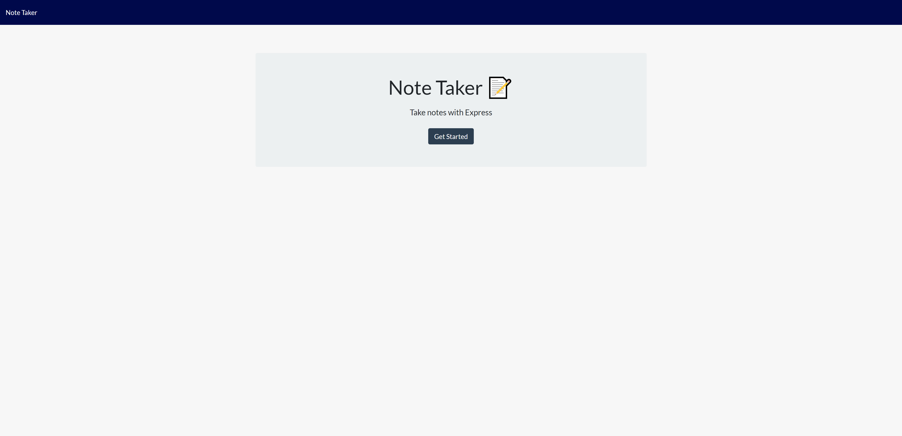
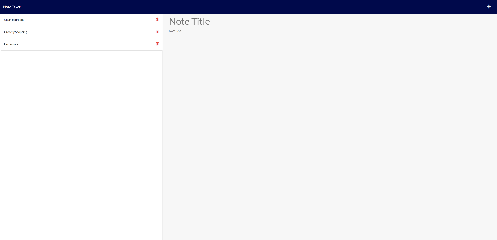

# Note Taker

Created an application to write and save notes. Uses Express.js back end to save and retrieve note data from JSON file.
Connects back end and front end using Heroku.

[Note Taker Heroku Deployed Site](https://notetaker-express-proj.herokuapp.com/)

## Table of Contents

* [Setup](#setup)
* [Usage](#usage)
* [Contributing](#contributing)
* [License](#license)

## Setup
:floppy_disk:

You can replicate this project by performing the following below:

Fork or clone this repository and open the files within to access the command prompt.

You can also recreate the project by using npm (Node Package Manager), Express.js and Heroku.

Go to [Node's website](https://nodejs.org/en/) and follow the download instructions for your appropriate setup. NPM, or Node Package Manager, is the default package manager for Node.js. It is distributed with Node.js. Do not forget to npm init if you are using it for the very first time.

Check that your system has the following npm:
- [Node Package Manager](https://nodejs.org/en/)
  - Run `npm install` in order to install the following npm package dependencies as specified in the `package.json`.
  - This will also help install express on your system and manage any other dependencies in your script.
- [Express](https://www.npmjs.com/package/express)
  - Express is a back end web application framework for Node.js. Released as free and open-source software under the MIT License. Designed for building web applications and APIs. Many users use it as a standard server framework for Node.js.
- [uniqid](https://www.npmjs.com/package/uniqid)
  - Creates unique id's based on current time, process and machine name.

`npm init`

`npm install express`

`npm install uniqid`

You can set up the server by using Heroku:
- [Heroku](https://devcenter.heroku.com/articles/heroku-cli)
  - Heroku Command Line Interface(CLI) to manage Heroku apps directly from the terminal. Requires Git to install the client.
  - In Git, go to your local terminal and type `heroku create`.
  - If at any point the files are changed, you can add the changed files to Heroku. Deployment steps rely on Git branch. Type:
    - `git add -A`
    - `git commit -m "Description"`
    - `git push heroku main` (Type `git push heroku `[ your branch name]`:main` if deployed in a local branch)
  - Ensure that your server is in the correct PORT.
  - For more documentation, see [Heroku Documentation](https://devcenter.heroku.com/categories/reference).

Start the server by running `npm start` in the command line.

## Usage

:computer:

See [Heroku Deployed Site](https://notetaker-express-proj.herokuapp.com/) or see below to run your own server.

Run `npm start` in the command line to start the server.

Either use Heroku (In Git, type `heroku open` to find your website server), or `http://localhost:3001/` to open up the site. Localhost server is contingent on your code.

- View a list of animals on Zooper.
- Enter a new animal into the database.
- Add a new Zookeeper in to the database.
- Filter your searches within the animal/zookeeper database.
- Travel between hosted pages.

## Contributing

:octocat:

[paperpatch](https://github.com/paperpatch)

## License

:receipt:

This project is licensed under MIT.
